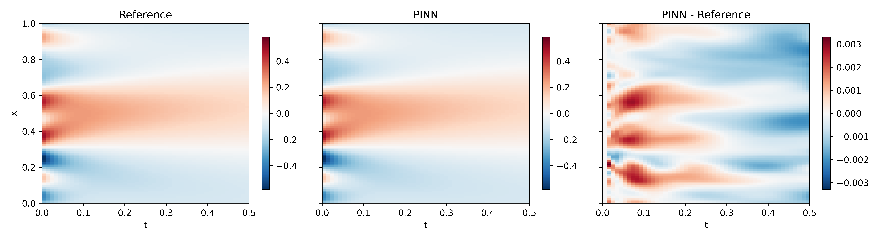

# burgers-pinn-jax
Solving the 1D viscous Burgers' equation with a Physics-Informed Neural Network implemented in JAX, Equinox, and Optax.
The model is implemented in **JAX**, **Equinox**, and **Optax** and is evaluated against a numerical reference solution generated with Exponax. This project demonstrates automatic differentiation for PDE residuals, hard physical constraints, periodic Fourier features, JIT-compiled training, and quantitative validation.

The PINN uses a coordinate-based multilayer perceptron to map each space-time coordinate $(t,x)$ to the solution $u(t,x)$. Periodic Fourier features enforce spatial periodicity, while a hard initial-condition formulation ensures that the initial condition is satisfied without an additional loss term. JAX automatic differentiation computes the derivatives required for the Burgers-equation residual. The model is trained by minimizing the mean squared PDE residual at randomly sampled collocation points using Equinox and the Optax Adam optimizer. The reference solution is used only to evaluate the model after training.

The PINN closely reproduces the reference solution across the space-time domain.

The notebook also visualizes the training history, reference and predicted fields, their error, and solution snapshots at several times.
